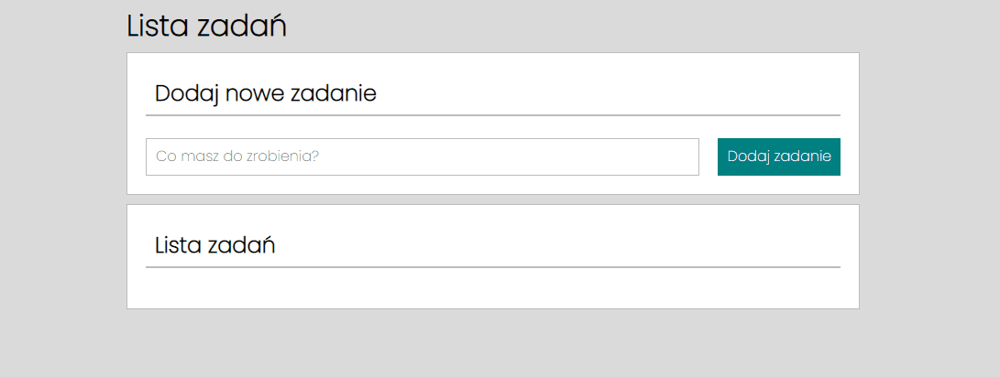

# To-Do-list

## DEMO
Here is my app **[To-Do List](https://rkowal10.github.io/to-do-list/)**.

## Description
That application allow you to create To-Do List. You can enter the tasks you need to complete and when you finish press the green button to know it's done. After that you can remove completed tasks by press red button.

## Used technologies
- HTML
- JavaScript
- CSS Grid
- Media queries
- BEM
